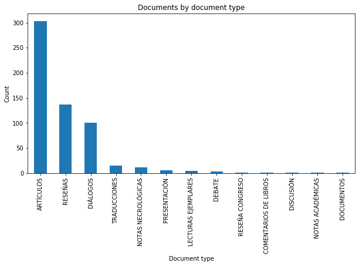
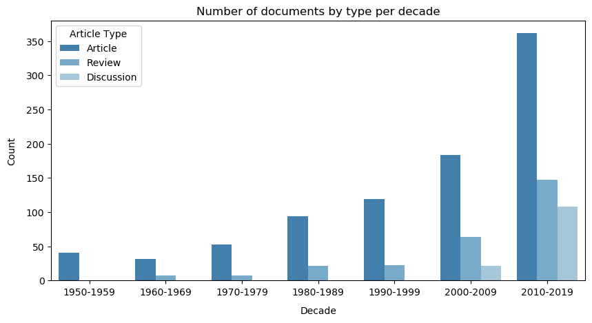
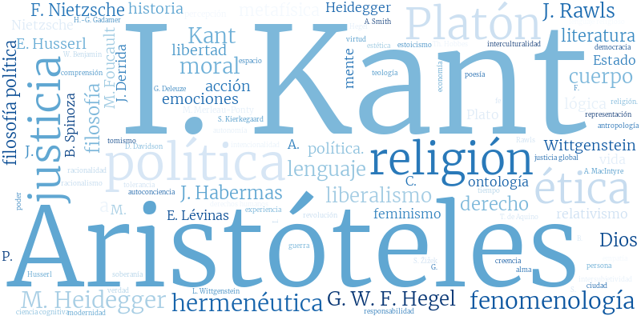
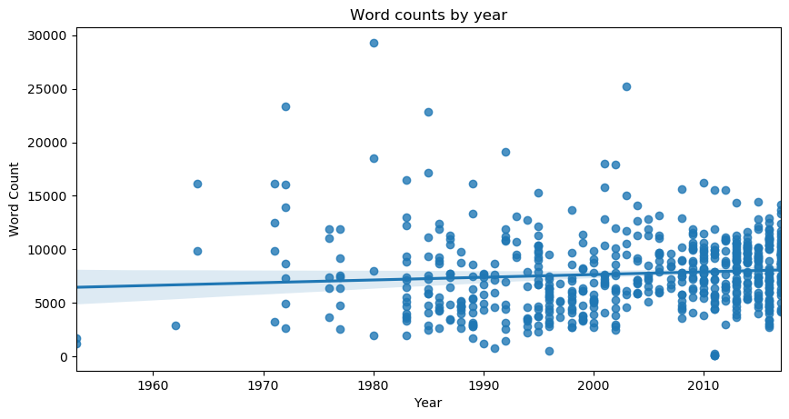
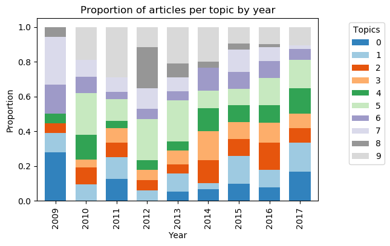

# Latin American Philosophy Mining

Authors: [Juan R. Loaiza](https://www.juanrloaiza.me) (URosario / HU Berlin) and [Miguel González Duque](https://www.miguelgondu.com) (ITU Copenhagen)

In this repository we track progress on a research project in which we apply text mining to philosophy journals in Latin America. Our aim is to provide insights into the history of philosophy in Latin America using a data-driven approach.

We are starting with [Ideas y Valores](https://revistas.unal.edu.co/index.php/idval/) (Colombia) and articles from 2009 to 2017. We plan on expanding later to include more years and other journals such as [Crítica](http://critica.filosoficas.unam.mx/index.php/critica) (Mexico) and [Análisis Filosófico](https://analisisfilosofico.org/index.php/af) (Argentina).

## Structure

    .
    ├── data                # Data files (omitted from Git repository for the moment)
    |   ├── raw_html        # Raw HTML files directly as scraped with metadata     
    |   └── clean_json      # Parsed HTML files and metadata in JSON format
    ├── extras               # Extra notebooks with additional processes or figures.
    ├── notebooks           # Notebooks with preprocessing and analyses
    |   └── wordlists       # Stopwords and protected words lists
    ├── utils               # Helper utilities
    └── README.md

## To-Do

* Extract view information from main HTML page.
* Calibrate the number of topics for the LDA model.
  * Implement LDA in gensim and use topic coherence measures to calibrate the number of topics.

## Preliminary figures and visualizations

#### Figure 1. Documents by document type.

#### Figure 2. Documents by main type per year.

#### Figure 3. Word cloud of the most mentioned philosophers in the corpus.

#### Figure 4. Word cloud of the most frequent keywords in the corpus according to article metadata.

#### Figure 5. Word counts by year.

### Using a provisional model

The following plots are only proofs of concept. We are using a temporary LDA model with 10 topics to find which visualizations would work best. There is still work to fully optmize the LDA model though. We use a model with the following top 10 most salient words.

| Topic 0        | Topic 1       | Topic 2   | Topic 3     | Topic 4   | Topic 5   | Topic 6     | Topic 7   | Topic 8      | Topic 9  |
|:-------------- |:------------- |:--------- |:----------- |:--------- |:--------- |:----------- |:--------- |:------------ |:-------- |
| lenguaje       | kant          | religioso | ser         | creencia  | ser       | político    | acción    | alma         | político |
| interpretación | concienciar   | religión  | cuerpo      | mundo     | mundo     | formar      | moral     | ser          | derecho  |
| teoría         | ser           | ciudad    | formar      | ser       | hegel     | vida        | ser       | platón       | moral    |
| experiencia    | concepto      | filosofía | heidegger   | teoría    | filosofía | ser         | accionar  | filosofía    | ser      |
| wittgenstein   | objetar       | historia  | modo        | propiedad | dios      | filosofía   | agente    | conocimiento | justicia |
| filosofía      | experiencia   | siglo     | aristóteles | término   | bien      | nietzsche   | personar  | sócrates     | bien     |
| ser            | arte          | cultura   | ente        | contener  | vida      | foucault    | desear    | hombre       | social   |
| problema       | husserl       | tradición | naturaleza  | concepto  | razón     | social      | intención | virtud       | sociedad |
| autor          | trascendental | ciencia   | bien        | físico    | hombre    | crítico     | bien      | bien         | teoría   |
| filosófico     | modo          | obrar     | existencia  | objeto    | pensar    | pensamiento | libertar  | obrar        | razón    |

### Figure 6. Proportion of articles by topic

### Figure 7. Word counts by topic.

