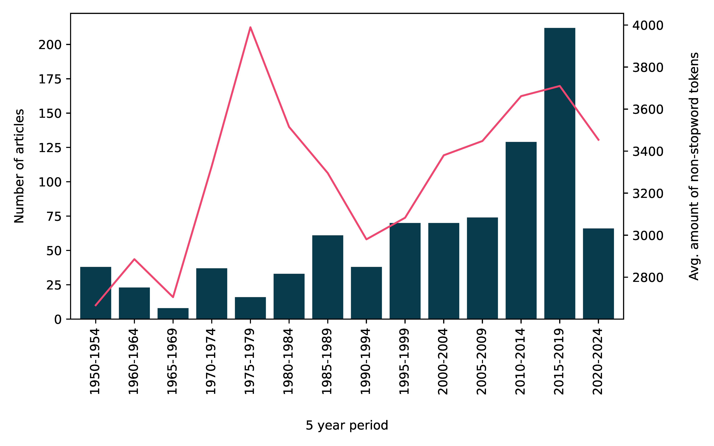
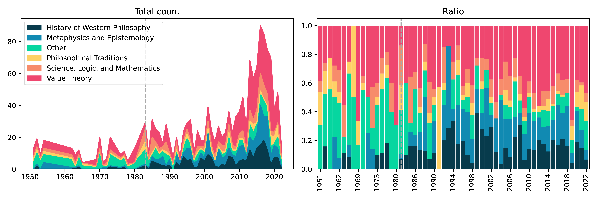
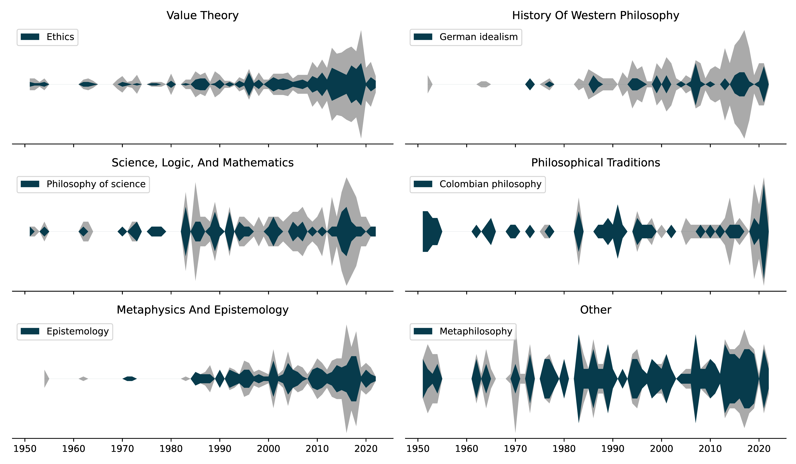

# Latin American Philosophy Mining

Authors: [Juan R. Loaiza](https://juanrloaiza.github.io/academic) (U. Alberto Hurtado, Chile) and [Miguel González Duque](https://www.miguelgondu.com) (Center for Basic Machine Learning in the Life Sciences, Denmark)

In this repository we track progress on a research project in which we apply text mining to philosophy journals in Latin America. Our aim is to provide insights into the history of philosophy in Latin America using a data-driven approach.

We started with [Ideas y Valores](https://revistas.unal.edu.co/index.php/idval/) (Colombia) and articles from 1951 to 2017.

## Structure

    ├── img                 # Selected figures for README.md
    ├── notebooks           # Notebooks with preprocessing and analyses.
    |   ├── models          # DTM model and related files
    |   ├── results         # Results from our analyzes, including figures and tags
    |   └── wordlists       # Stopwords and protected words lists
    ├── utils               # Helper utilities
    └── README.md

## Some figures and visualizations

