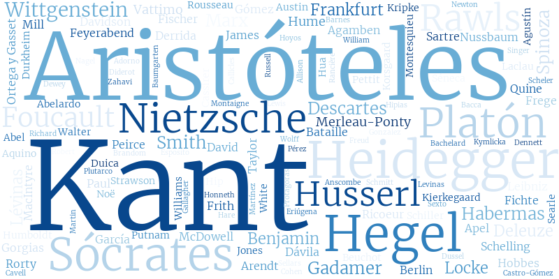

# Latin American Philosophy Mining

Authors: [Juan R. Loaiza](https://www.juanrloaiza.me) (URosario / HU Berlin) and [Miguel González Duque](https://www.miguelgondu.com) (ITU Copenhagen)

In this repository we are applying text mining to philosophy journals in Latin America.

We are starting with [Ideas y Valores](https://revistas.unal.edu.co/index.php/idval/) (Colombia) and articles from 2009 to 2017. We plan on expanding later to include more years and other journals such as [Crítica](http://critica.filosoficas.unam.mx/index.php/critica) (Mexico) and [Análisis Filosófico](https://analisisfilosofico.org/index.php/af) (Argentina).

*Figure 1. Word cloud of the most mentioned philosophers in the corpus.*

## Structure

    .
    ├── data                # Data files (omitted from Git repository for the moment)
    |   ├── raw_html        # Raw HTML files directly as scraped with metadata     
    |   └── clean_json      # Parsed HTML files and metadata in JSON format
    ├── utils               # Helper utilities
    ├── notebooks           # Notebooks with preprocessing and analyses
    |   └── wordlists       # Stopwords and protected words lists
    └── README.md

## To-Do

* Extract view information from main HTML page.
